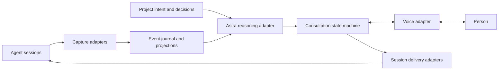

# Architecture direction

Status: the first single-user preview implements the core, HTTP service, browser
UI, scoped conversation collection, an optional Codex delivery bridge and provider
boundaries. Isolated native Codex transport passes and earlier bounded provider
checks succeeded; current provider authentication is tracked in verification.
Working-agent use, browser voice and native audio/screen
validation remain pending.
See [operations](operations.md) for limits.

## Boundaries

The deployment-independent core owns identities, event normalization, project
decisions, consultations, delivery records, and replay. Provider SDK objects are
translated at adapter boundaries. A cloud service and a local installation use
the same domain behavior and contract tests.

## Initial provider connection

The selected approach is the GPT Live public API with a new API key dedicated
to InnoVox. GPT Live provides the voice experience and Astra supplies reasoning
through their adapter boundaries. Keep the long-lived provider key on the server
or in a protected local configuration, outside browser bundles and public source.

The first browser voice adapter uses WebRTC and server-side HTTP session creation.
Protected credential persistence and earlier bounded Astra/GPT Live access are
verified. Current authentication and the browser WebRTC path need live validation.

## Cloud-first capture

A cloud service cannot observe arbitrary desktop windows or private local
session files. Local sessions need a deliberately connected companion or an
integration inside their host. Prefer outbound connections from the companion;
do not expose an unauthenticated desktop control port.

Distinguish three connector capabilities:

- **Observe:** read accessible history/events without running another agent.
- **Manage:** own an agent process/session lifecycle and its input stream.
- **Deliver:** add context or answers to a precisely identified existing session.

A resume API does not establish safe attachment to a concurrently running
desktop session. Test that boundary with the actual supported application.

Capture structured events first, persisted history for recovery, and screen or
accessibility context where useful. Record source completeness and visibility.
Do not assume displayed text equals the model-visible transcript.

## State model

- Keep source observations, interpretations, and confirmed decisions distinct.
- Identify the project, host/source, session, branch, and lifecycle epoch.
- Carry stable event identity, per-source ordering/cursor, occurrence and
  observation timestamps, schema version, and source references.
- Treat snapshots and stream subscription as one consistency problem: avoid a
  gap between reading the snapshot and starting incremental collection.
- Preserve unknown event kinds; represent missing data explicitly.
- Store long transcripts and attachments outside the reasoning prompt. Supply
  changes and relevant source-bound project context.

Project constraints include their reason, scope, source, revision, and explicit
supersession. A temporary exception must not silently become a global rule.

## Proactive reasoning

A candidate intervention includes observed evidence, relevant project decisions,
the benefit of acting now, intended recipients, and invalidation conditions.

Choose among background context, a visible suggestion, and a spoken question.
Do not wait for an AskUser event. Do not repeatedly trigger on InnoVox's own
injected messages: preserve origin and causation identities.

The head is Astra. Provider-neutral boundaries enable future alternatives but
do not authorize silently substituting another model.

## Consultation and delivery

Track question creation, presentation, received answer, resolved interpretation,
delivery attempt, and confirmed delivery separately. Also model cancellation,
expiration, supersession, ambiguity, and an unknown delivery outcome.

Bind a reply to the consultation and the relevant session/context epoch. Do not
use the foreground window or a bare "yes" as a routing decision. Revalidate
relevant preconditions before delivery. A generic new token is not necessarily
a meaningful reason to invalidate a question.

Use durable delivery intent and application-level deduplication. After losing an
acknowledgment, reconcile the result before retrying an externally visible
operation. Do not claim network-wide exactly-once execution.

Speech interruption, backend cancellation, context-injection acknowledgment,
audio playback, and the person's understanding are distinct observations.

## Open interfaces and version compatibility

- Publish domain payload schemas, reference adapters, synthetic fixtures, and
  conformance tests.
- MCP exposes tools/context; it does not own the complete conversation journal.
- ACP is an adapter option for supporting coding agents, not a universal attach
  API for arbitrary desktop applications.
- Keep provider-specific reasoning and voice APIs behind explicit capabilities.
- Record source application, protocol, adapter, and domain-schema versions
  separately. Record model/prompt/context versions for derived decisions.
- Test supported combinations, preserve unknown content, and disable unsupported
  writes without fabricating success.

The MCP 2026-07-28 revision changes initialization, protocol session state,
elicitation, and reconnect behavior. Compatibility must be tested by negotiated
behavior rather than a single "MCP supported" flag.

## Runtime and language decisions

The first service uses TypeScript, Node.js 24 and native SQLite. The same service
runs locally or on a single cloud host. [ADR 0001](decisions/0001-cloud-first-runtime.md)
records the decision and limits. Rust and a Swift macOS companion remain native
adapter candidates; neither is required for the first cloud service.

Local storage and hosted storage may differ behind the same transactional domain
operations. Avoid a shared writable database file across machines. Production
service storage requires tenant isolation, retention, export/deletion behavior,
and bounded resource consumption.

## Performance and failure design

- Separate capture, persistence, inference, voice, and delivery queues.
- Bound queues and coalesce disposable partial updates; preserve decisions,
  final messages, and delivery records.
- A slow model or adapter must not block capture or the person's interruption.
- Cache unchanged context and discard stale reasoning results.
- Measure tail latency, recovery, long-running memory/storage growth, and
  conversational usefulness on stated workloads.
- Keep credentials outside browser bundles and logs. Treat captured content as
  untrusted data and scope access by user/project/source.

## Reference snapshot

Reviewed on 2026-09-25. Documentation establishes advertised interfaces, not live
access, pricing, supported-account availability, or end-to-end acceptance.

- [Codex App Server](https://learn.chatgpt.com/docs/app-server)
- [Claude Code Hooks](https://code.claude.com/docs/en/hooks)
- [Claude Agent SDK sessions](https://code.claude.com/docs/en/agent-sdk/sessions)
- [GPT Live delegation](https://developers.openai.com/api/docs/guides/live-delegation)
- [ACP initialization](https://agentclientprotocol.com/protocol/v1/initialization)
- [MCP 2026-07-28 changes](https://modelcontextprotocol.io/specification/2026-07-28/changelog)
